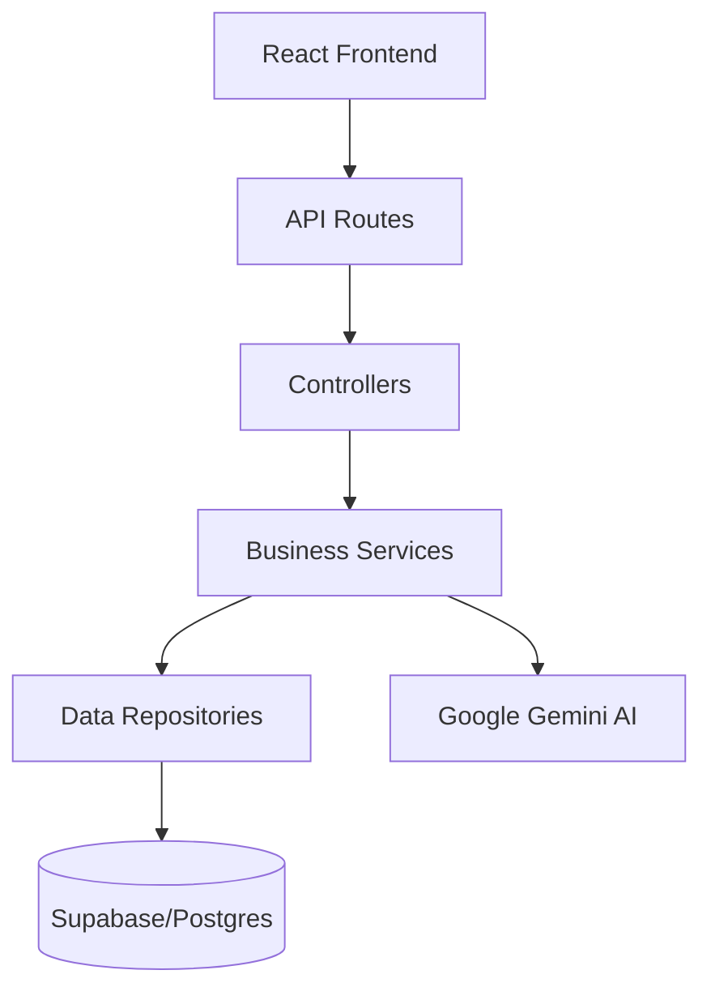

# 🍽️ Global Bites Menu


Uma plataforma moderna de cardápio digital e gestão administrativa inteligente, desenvolvida com uma arquitetura robusta e fluxos de trabalho assistidos por Inteligência Artificial de ponta (Gemini Pro).

---

## 📖 Sumário
- [🚀 Setup Local](#-setup-local)
- [🤖 AI Workflow & Strategic Insights](#-ai-workflow--strategic-insights)
- [🏗️ Estrutura de Prompting (Framework COCDQ)](#️-estrutura-de-prompting-framework-cocdq)
- [🧠 Feature Inteligente: AI Chef Assistant](#-feature-inteligente-ai-chef-assistant)
- [🏗️ Arquitetura Técnica](#️-arquitetura-técnica)
- [📚 Estrutura de Pastas e Scripts](#-estrutura-de-pastas-e-scripts)
- [🔧 Troubleshooting](#-troubleshooting)
- [🔗 Links e Recursos](#-links-e-recursos)

---

## 🚀 Setup Local

### 1. Clonar o Repositório
```bash
git clone https://github.com/seu-usuario/global-bites-menu.git
cd global-bites-menu
```

### 2. Configurar Variáveis de Ambiente
Crie um arquivo `.env` na raiz do projeto (veja `.env.example`):
```env
VITE_SUPABASE_URL=seu_url_do_supabase
VITE_SUPABASE_ANON_KEY=sua_chave_anon_do_supabase
VITE_GEMINI_API_KEY=sua_chave_do_google_generative_ai
```

### 3. Instalar Dependências
```bash
npm install
```

### 4. Configurar Supabase
1. Vá para o **SQL Editor** no painel do Supabase.
2. Execute o conteúdo de `backend/schema.sql`.
   - Isso criará as tabelas `dishes`, `menus`, `menu_dishes`, `orders` e `order_items`.
   - Configurará as políticas de **Row Level Security (RLS)**.
   - Criará o bucket de storage `dishes` para imagens.
3. Execute também o conteúdo de `backend/supabase/schema_analytics.sql`.
   - Isso criará a tabela `ai_analytics_logs` necessária para o módulo de relatórios estratégicos.

### 5. Executar o Projeto
```bash
npm run dev
```

---

## 🤖 AI Workflow & Strategic Insights

O projeto utiliza uma estratégia de **IA Híbrida** para otimizar tanto a operação quanto a gestão.

### 🛠️ Modelos Utilizados
- **Gemini 1.5 Flash:** Geração ultra-rápida de descrições e análise multimodal de imagens.
- **Gemini 1.5 Pro:** Lógica de negócios complexa e refatorações de código.
- **Gemini 2.0 Flash:** Chat interativo com clientes e análise estratégica de dados.

### 📋 Prompts de Engenharia (Workflow Real)

> [!TIP]
> **Prompt 1: Modelagem de Relacionamento N:N & RLS (DBA)**
> "Atue como um DBA Sênior. Gere o SQL para uma tabela de junção `menu_dishes` que relacione `menus` e `dishes`. Implemente integridade referencial com `ON DELETE CASCADE`. Adicione políticas de Row Level Security (RLS) no Supabase que permitam leitura pública (`anon`), mas restrinjam a escrita apenas para usuários autenticados (`authenticated`)."

> [!TIP]
> **Prompt 2: Lógica de Gateway e Abstração (Arquitetura)**
> "Implemente um padrão Gateway no TypeScript para centralizar as chamadas ao Supabase. Crie uma classe `MenuService` que abstraia a complexidade das queries de associação e retorne tipos fortemente tipados para o frontend Vite, garantindo que o erro de quota da IA não interrompa o fluxo principal (Graceful Degradation)."

### 🏗️ Estrutura de Prompting (Framework COCDQ)
Para garantir a máxima precisão e consistência nas implementações, utilizei a metodologia de prompts estruturados em todos os diálogos complexos:

- **Context:** Explicação de onde o código se encaixa no projeto.
- **Objective:** O que exatamente deve ser feito e qual o resultado esperado.
- **Constraints:** Stack (React/Supabase), padrões de design e limites técnicos.
- **Deliverable:** Arquivos específicos a serem criados ou modificados.
- **Quality bar:** Critérios de qualidade, tratamento de erros e performance.

---

## 🧠 Feature Inteligente: AI Chef Assistant

A feature de destaque é o **AI Chef Assistant**, integrado diretamente no fluxo de criação de pratos.

### Como Funciona
1. O administrador insere o nome e ingredientes básicos.
2. A IA gera instantaneamente:
   - **Descrição Gourmet**: Storytelling focado em apetite.
   - **Chef's Pairing**: Sugestão estratégica de acompanhamento.
   - **Creative Enhancements**: Sugestão de ingredientes extras para elevar o prato.
   - **Tags Inteligentes**: Classificação automática (Spicy, Vegan, etc).

> [!NOTE]
> Todas as ações da IA são registradas na tabela `ai_logs`, permitindo que o administrador acompanhe a taxa de aprovação e a precisão do modelo no módulo **Reports & Insights**.

---

## 🏗️ Arquitetura Técnica

Utilizamos uma **Arquitetura em Camadas** desacoplada no backend, permitindo que a lógica de negócio seja testável e independente do Supabase.



### Abstração de Dados
O backend atua como um **Gateway de Serviços**. O frontend não chama o Supabase diretamente para lógica complexa; ele consome métodos do `backend/index.ts`, que orquestra Repositories e Services.

---

## 📚 Estrutura de Pastas e Scripts

### Organização do Código
- `backend/`: Serviços de negócio, controllers e abstrações de dados.
- `src/features/`: Módulos funcionais (Admin, Public View, Analytics).
- `src/context/`: Estado global (Auth, Menu, Shopping Cart).

### Scripts Principais
- `npm run dev`: Ambiente de desenvolvimento (Vite).
- `npm run build`: Compilação otimizada para produção.
- `npm run lint`: Verificação de padrões de código.

---

## 🔧 Troubleshooting

### Erro de Conexão Supabase
- Verifique se as variáveis no `.env` possuem o prefixo `VITE_`.
- Confirme se o bucket `dishes` está marcado como **Public** no dashboard.

### Quota do Gemini (429 Error)
- O sistema possui um modo de **Graceful Degradação**. Se a quota expirar, o botão de geração exibirá um aviso amigável e permitirá a inserção manual sem quebrar a aplicação.

---

## 🔗 Links e Recursos
- **Documentação Supabase:** [supabase.com/docs](https://supabase.com/docs)
- **Gemini API:** [ai.google.dev](https://ai.google.dev)
- **Repositório:** [GitHub Global Bites](https://github.com/seu-usuario/global-bites-menu)

---

> [!NOTE]
> Este projeto demonstra como o desenvolvimento orientado por IA, aliado a uma arquitetura limpa, pode entregar uma plataforma enterprise em tempo recorde.
